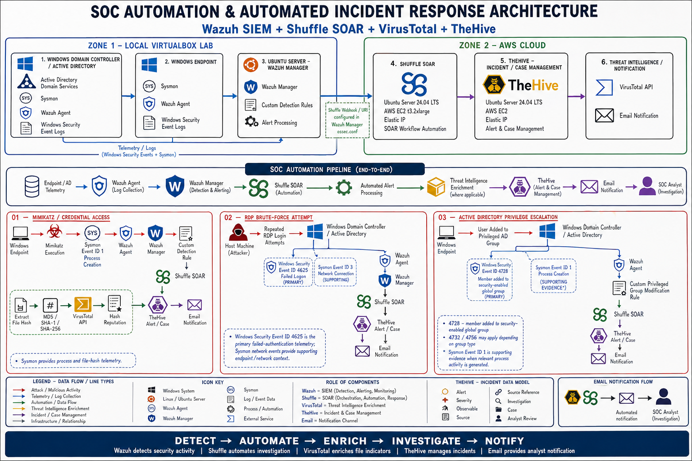

# SOC Architecture

This architecture represents the SOC automation environment combining a local virtual lab with cloud-hosted security automation components.

## Architecture Diagram

## Environment

### Local Virtual Lab
- Wazuh Server
- Windows Domain Controller
- Windows Endpoint

### Cloud Infrastructure
- Shuffle SOAR
- TheHive

## Security Flow

Windows Endpoint / Domain Controller
→ Sysmon / Windows Events
→ Wazuh Agent
→ Wazuh Manager
→ Shuffle SOAR
→ VirusTotal / TheHive / Gmail
