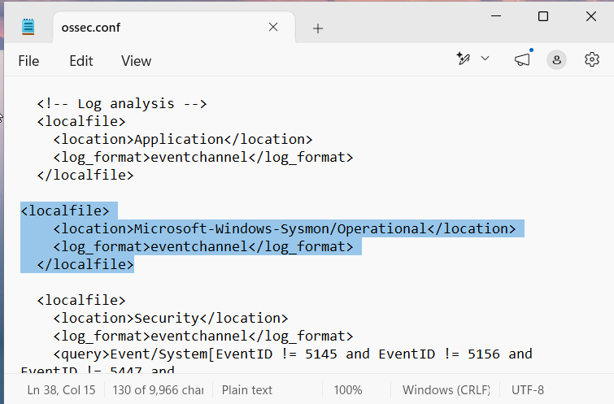
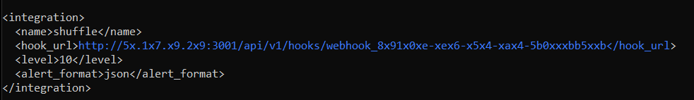
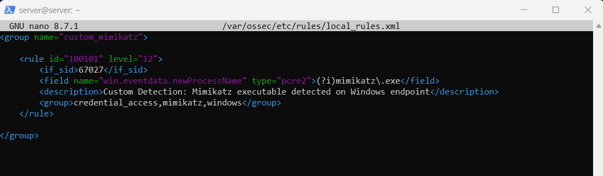
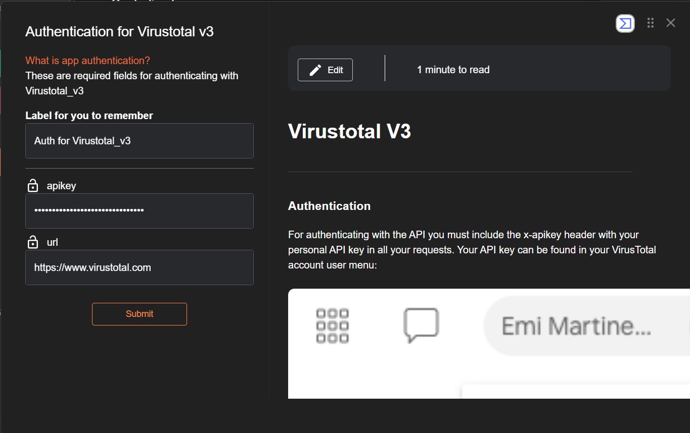
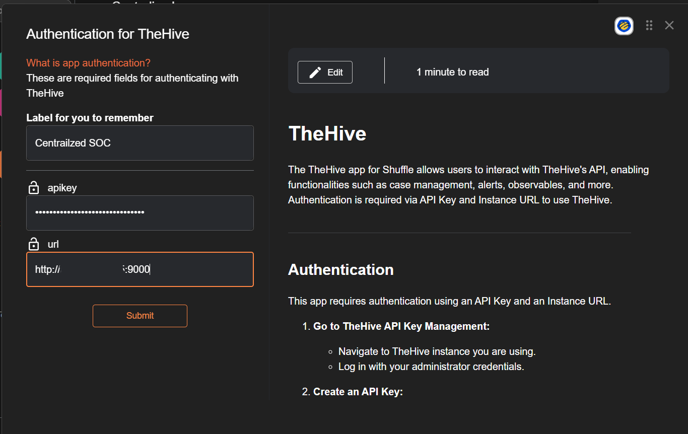

# Integration

This section documents the integrations used to connect the endpoint, SIEM, SOAR, threat-intelligence, and case-management components of the SOC environment.

---

# 01. Wazuh Agent → Wazuh Manager

The Wazuh Agent is registered with the Wazuh Manager using the Manager IP address so that endpoint security events can be forwarded to the central Wazuh server.

### Wazuh Agent Manager Configuration

> Add the Wazuh Manager address to the Wazuh Agent configuration:

```xml
<client>
    <server>
        <address>WAZUH_MANAGER_IP</address>
    </server>
</client>
```
## Replace:
```
WAZUH_MANAGER_IP
```
> with the Wazuh Manager IP address used in the lab.
> Restart Wazuh Agent
> Restart-Service -Name Wazuh

## Evidence


# 02. Sysmon → Wazuh Agent

The Wazuh Agent is configured to collect Sysmon Operational events from the Windows endpoint.

## Wazuh Agent Sysmon Collection

> Add the following configuration inside the <ossec_config> section of the Wazuh Agent configuration:
```
<localfile>
    <location>Microsoft-Windows-Sysmon/Operational</location>
    <log_format>eventchannel</log_format>
</localfile>
```
> Restart Wazuh Agent
> Restart-Service -Name Wazuh
## Evidence


# 03. Wazuh Manager → Shuffle SOAR

Wazuh Manager is integrated with Shuffle SOAR through a webhook so that selected security alerts can be automatically forwarded to the SOAR workflow.

## Wazuh Shuffle Integration

> Add the following configuration inside the <ossec_config> section of the Wazuh Manager ossec.conf file:
```
<integration>
    <name>shuffle</name>
    <hook_url>YOUR_SHUFFLE_WEBHOOK_URL</hook_url>
    <level>YOUR_ALERT_LEVEL</level>
    <alert_format>json</alert_format>
</integration>
```
## Replace the environment-specific values with the actual Shuffle webhook URL and alert level used in the lab.

## Restart Wazuh Manager
```
sudo systemctl restart wazuh-manager
```
## Evidence



# 04. Wazuh Custom Detection Rules (Mimikatz detection in project)

Custom Wazuh rules are used to detect security events relevant to the SOC detection scenarios.

The custom rules are stored in the Wazuh Manager local rules file.

## Open Local Rules
```
sudo nano /var/ossec/etc/rules/local_rules.xml

<!-- Mimikatz execution detection rule -->
<rule id="YOUR_RULE_ID" level="YOUR_LEVEL">
    <!-- Add the actual rule conditions used in the lab -->
</rule>
```
## Test Wazuh Rules
```
sudo /var/ossec/bin/wazuh-logtest
```
## Restart Wazuh Manager
```
sudo systemctl restart wazuh-manager
```
## Evidence


# 05. Shuffle SOAR → VirusTotal

VirusTotal is integrated with the Shuffle SOAR workflow to enrich relevant indicators with threat-intelligence information.

The integration is configured through the Shuffle web interface.

## Evidence



# 06. Shuffle SOAR → TheHive

TheHive is integrated with the Shuffle SOAR workflow for automated security alert and case management.

The integration is configured through the Shuffle web interface.

## Evidence

