# Detection Scenarios

This section documents the security scenarios simulated in the SOC lab and their detection through Wazuh.

---

## 01. Mimikatz Execution

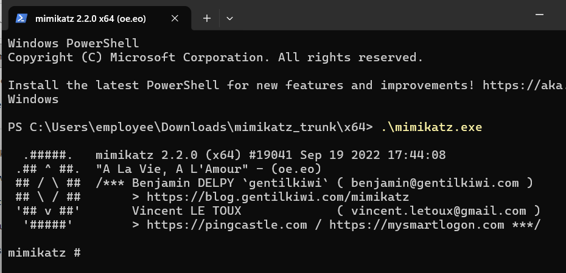

Mimikatz execution is detected using Sysmon process telemetry and a custom Wazuh detection rule.

## Mimikatz Detection

### Evidence

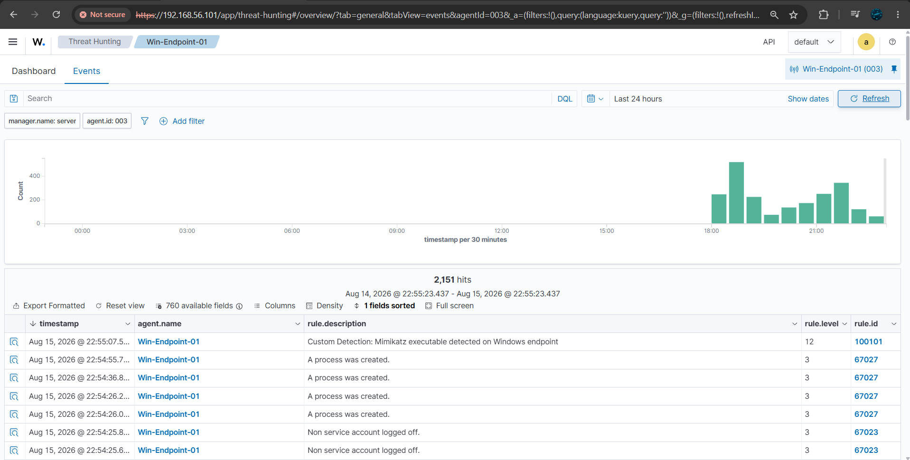

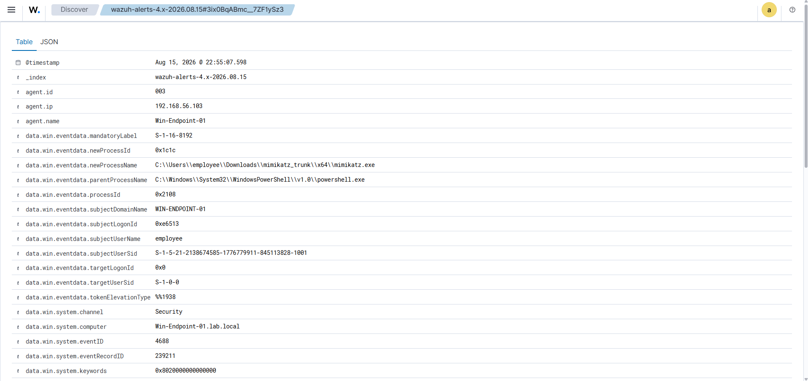

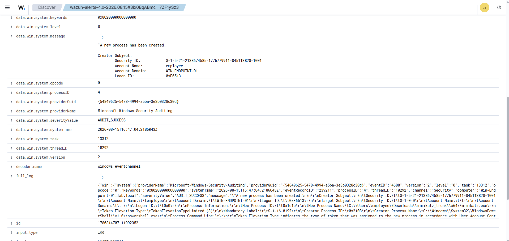

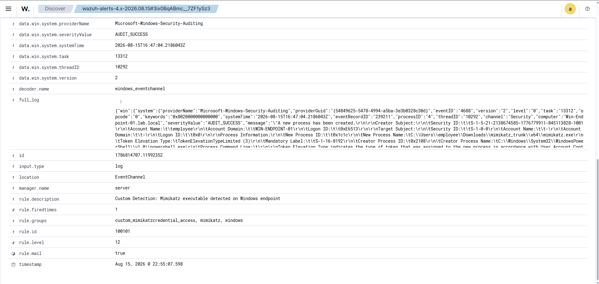

---

## 02. RDP Brute Force

Multiple failed RDP authentication attempts are generated against the Windows system and detected through Windows Security Event ID 4625.

### Evidence

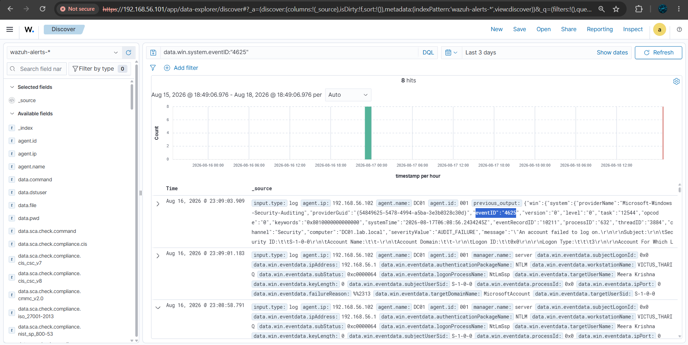

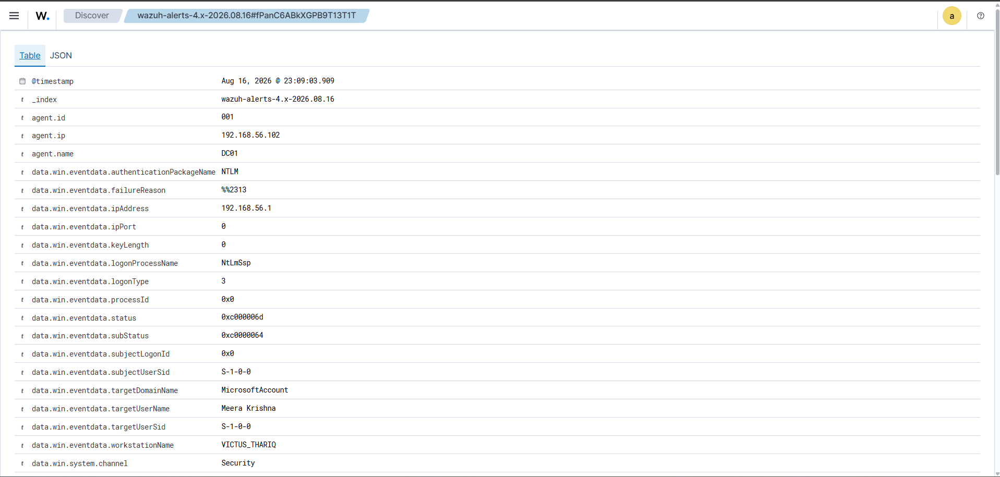

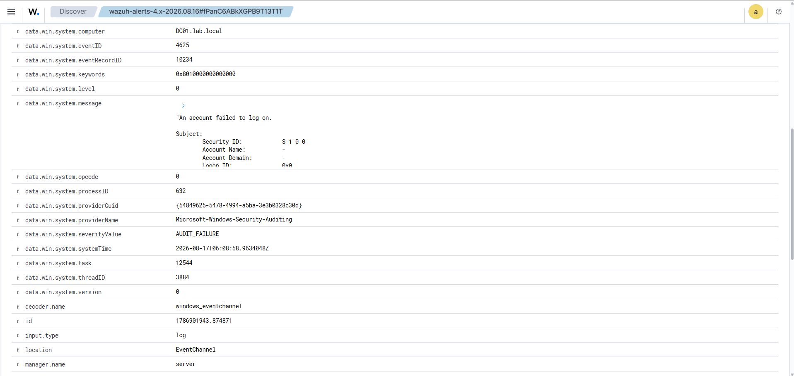

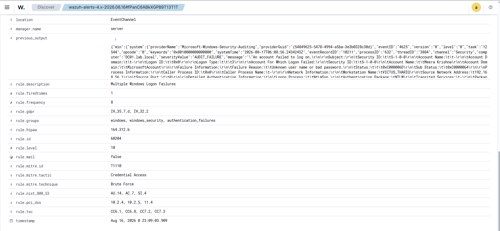

---

## 03. Active Directory Group Modification/Privilege Escalation

A domain user is added to a privileged Active Directory group, generating Windows Security Event ID 4728.

### Evidence

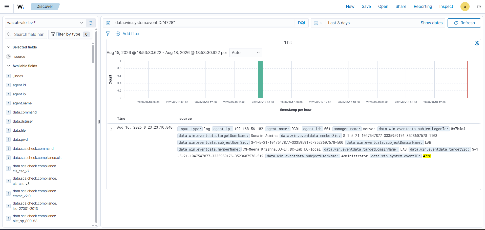

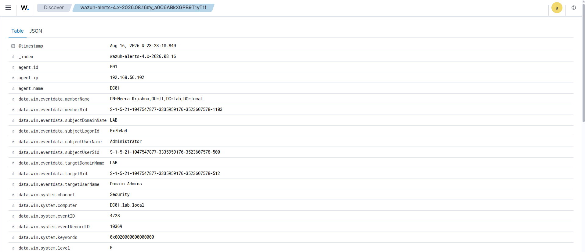

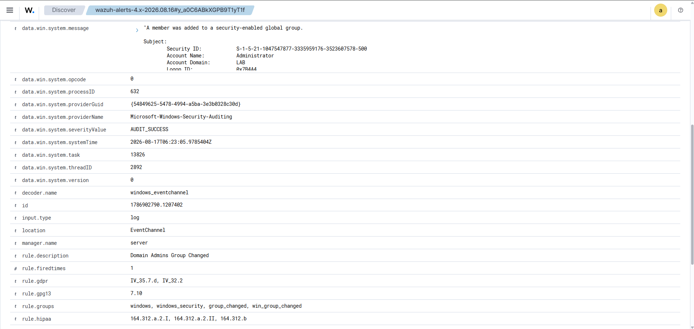

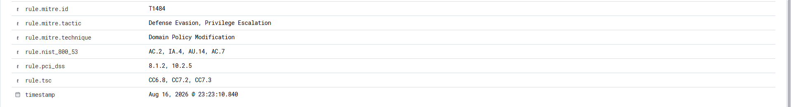
