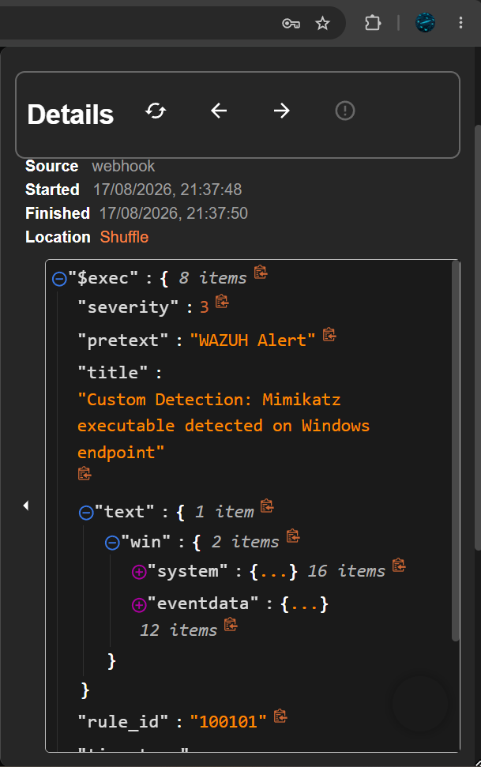
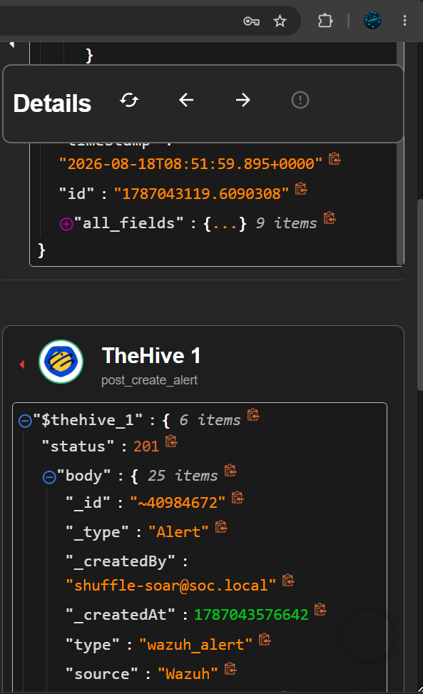
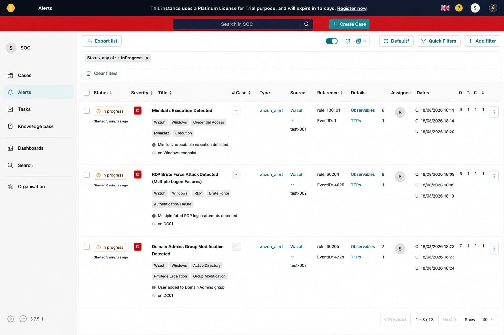

# Response Workflow

This section documents the automated response workflow triggered after a security alert is detected by Wazuh.

---

## 01. Wazuh Alert → Shuffle SOAR

The detected Wazuh alert is forwarded to Shuffle SOAR through the configured webhook and processed by the automated workflow.

### Evidence

---

## 02. Shuffle SOAR → TheHive

After processing the alert, Shuffle SOAR sends the relevant alert information to TheHive for case management.

### Evidence

---

## 03. TheHive Case Management

TheHive receives the processed security alert and creates a case for further SOC investigation and incident management.

### Evidence

