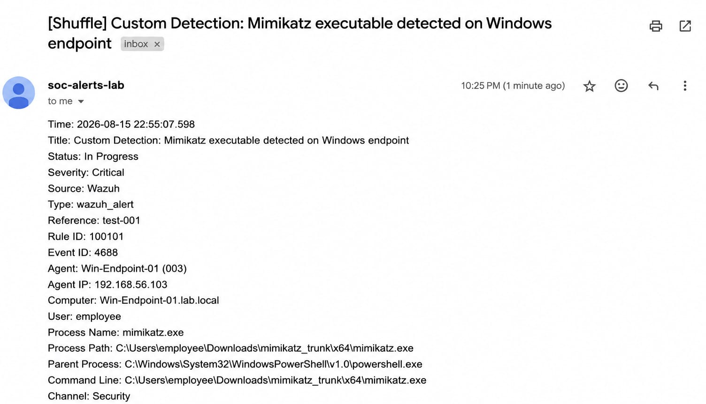
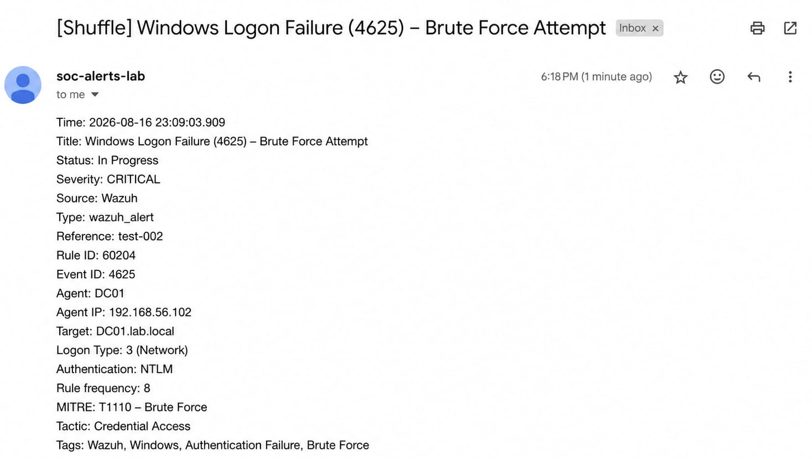
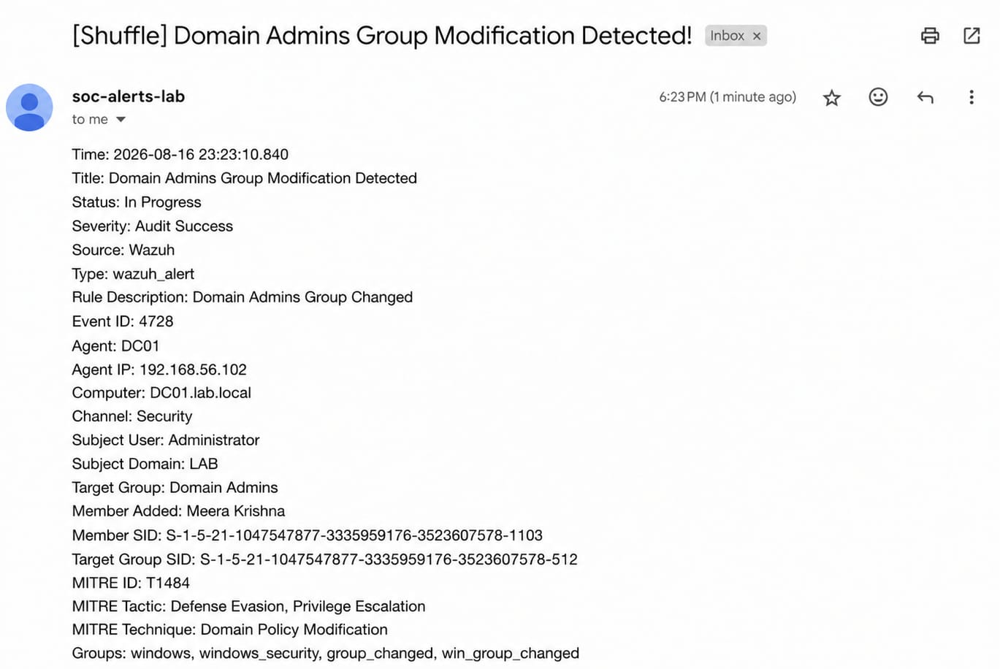

# Notifications

This section documents the automated email notifications generated after security alerts are processed through the SOC automation workflow.

---

## 01. Mimikatz Detection Notification

An automated email notification is generated when the Mimikatz detection workflow is triggered.

### Evidence

---

## 02. RDP Brute Force Notification

An automated email notification is generated when repeated RDP authentication failures are detected.

### Evidence

---

## 03. Active Directory Group Modification Notification

An automated email notification is generated when a privileged Active Directory group modification is detected.

### Evidence

