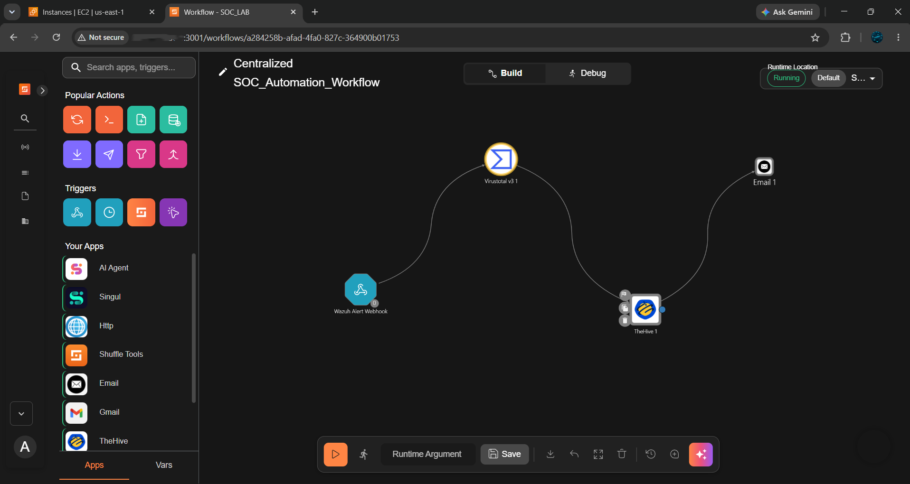

<div align="center">

# 🛡️ SOC AUTOMATION

### Wazuh SIEM • Shuffle SOAR • TheHive • VirusTotal • Gmail

**Automated Security Monitoring • Threat Detection • SOAR • Incident Response**

<br>


<br>


<br><br>

━━━━━━━━━━━━━━━━━━━━━━━━━━━━━━━━━━━━━━━━━━━━━━━━━━

### 🔴 DETECTION &nbsp; • &nbsp; 🟠 ENRICHMENT &nbsp; • &nbsp; 🔵 AUTOMATION &nbsp; • &nbsp; 🟢 RESPONSE

━━━━━━━━━━━━━━━━━━━━━━━━━━━━━━━━━━━━━━━━━━━━━━━━━━

</div>

## 🔎 Overview

This project demonstrates an end-to-end **Security Operations Center (SOC) automation workflow** built in an isolated cybersecurity lab environment.

Security events generated on Windows endpoints are collected through **Sysmon** and **Wazuh Agent**, analyzed by **Wazuh SIEM**, and automatically processed through **Shuffle SOAR**.

The workflow demonstrates:

> **Detection → Alert Processing → Threat Intelligence → Case Management → Notification**

---

## ⚡ SOC Automation Flow

<div align="center">



```text
┌──────────────────────┐
│   Windows Endpoints  │
│  Windows 11 / AD DC  │
└──────────┬───────────┘
           │
           ▼
┌──────────────────────┐
│        Sysmon        │
│ Endpoint Telemetry   │
└──────────┬───────────┘
           │
           ▼
┌──────────────────────┐
│     Wazuh Agent      │
│   Event Collection   │
└──────────┬───────────┘
           │
           ▼
┌──────────────────────┐
│    Wazuh Manager     │
│   SIEM + Detection   │
└──────────┬───────────┘
           │
         Webhook
           │
           ▼
┌──────────────────────┐
│     Shuffle SOAR     │
│ Workflow Automation  │
└───────┬──────┬───────┘
        │      │
        ▼      ▼
┌───────────┐ ┌──────────────┐
│ VirusTotal│ │   TheHive    │
│ Enrichment│ │  Case Mgmt   │
└───────────┘ └──────────────┘
             │
             ▼
┌──────────────────────┐
│   Gmail Notification │
└──────────────────────┘
```
</div>


## Detection Scenarios

The project demonstrates detection of three security scenarios:

## 🔴Mimikatz Execution
Detection of Mimikatz executable execution
Sysmon process telemetry
Custom Wazuh detection rule
Automated Shuffle workflow
## 🟠RDP Brute Force
Multiple failed Windows logon attempts
Windows Event ID 4625
Network logon / RDP authentication activity
Automated alert processing
## 🟡Active Directory Group Modification/Privilege Escalation
Domain user added to the Domain Admins group
Windows Event ID 4728
Detection of privileged group modification
Automated alert processing

| Component        | Purpose                                |
| ---------------- | -------------------------------------- |
| Wazuh            | SIEM, log collection and detection     |
| Wazuh Agent      | Endpoint telemetry collection          |
| Sysmon           | Windows process and security telemetry |
| Shuffle          | SOAR and workflow automation           |
| TheHive          | Security alert and case management     |
| VirusTotal       | Threat intelligence enrichment         |
| Gmail            | Automated security notifications       |
| Windows Server   | Active Directory / Domain Controller   |
| Windows Endpoint | Monitored workstation                  |
| Ubuntu Server    | Security infrastructure                |
| AWS EC2          | Cloud-hosted infrastructure            |
| VirtualBox       | Local virtual lab environment          |


## Project Documentation
01. Architecture
Overall SOC architecture and security component relationships.

02. Lab Environment
Virtual machines, cloud infrastructure, system specifications and internal network design.

03. Configuration
Core Sysmon, Wazuh Agent and Wazuh integration configurations used by the project.

04. Detection Scenarios
Detailed evidence and detection implementation for Mimikatz, RDP brute force and Active Directory group modification.

05. Shuffle Automation
SOAR workflow, Wazuh integration and external service integrations.

06. Case Management
TheHive alert creation and SOC case-management evidence.

07. Notifications
Automated email notifications generated from detected security events.

## Key SOC Concepts Demonstrated

- SIEM monitoring

- Windows event analysis

- Sysmon telemetry

- Custom detection rules

- Active Directory security monitoring

- Authentication failure detection

- Privileged group modification detection/Escalation

- SOAR automation

- Threat intelligence enrichment

- Alert management

- Security notification workflows

- MITRE ATT&CK mapping

## Disclaimer
This project was developed in an isolated lab environment for educational and defensive security purposes.
All IP addresses, credentials, API keys and environment-specific values used in configuration examples should be replaced when reproducing the setup.

